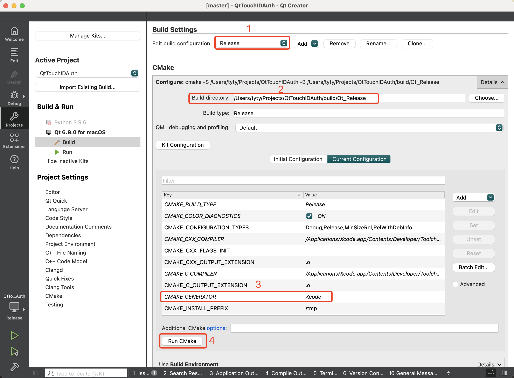
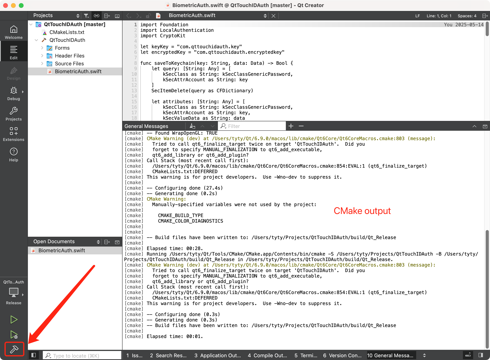

## How to build

### Build with CMake & Xcode

1. Generate Xcode profile file:

```bash
$ cd <project dir>
$ cmake -B build -G Xcode -DCMAKE_PREFIX_PATH=<Qt dir>
# e.g.
# cmake -B build -G Xcode -DCMAKE_PREFIX_PATH=~/Qt/6.9.0/macos
$ open ./build/QtTouchIDAuth.xcodeproj/
```

2. Build in Xcode.

### Build in QtCreator

1. Edit build settings:
   
   - Select build mode: Debug/Release.
   
   - Select build directory.
   
   - Set **CMAKE_GENERATOR** to **Xcode**.
   
   - Run CMake.



2. Build the app bundle



Now you'll get a runnable .app file under `./build/<build directory>/<build mode>/`

```bash
$ ls ./build/Qt_Release/Release             
QtTouchIDAuth.app         QtTouchIDAuth.app.dSYM    QtTouchIDAuth.swiftmodule
```

## Qt Framework Packaging & App Signing

The current `.app` file depends on Qt's framework files which are hardcoded absolute paths:

```bash
$ otool -l ./build/Qt_Release/Release/QtTouchIDAuth.app/Contents/MacOS/QtTouchIDAuth | grep -A2 LC_RPATH
          cmd LC_RPATH
      cmdsize 48
         path /Users/xxx/Qt/6.9.0/macos/lib (offset 12)
```

We need to use the `macdeployqt` tool to bundle these frameworks into the `.app`'s `Frameworks` folder to ensure the application can run properly in non-development environments:

```bash
$ ~/Qt/6.9.0/macos/bin/macdeployqt ./build/Qt_Release/Release/QtTouchIDAuth.app 
```

However this will invalidate the code signature:

```bash
$ codesign --verify --verbose ./build/Qt_Release/Release/QtTouchIDAuth.app                              
./build/Qt_Release/Release/QtTouchIDAuth.app: invalid signature (code or signature have been modified)
In architecture: arm64
```

At this point, double-clicking the app will cause it to crash due to an invalid signature. Therefore, we need to re-sign it using `codesign`.

```bash
$ codesign --deep --force --sign "Apple Development: XXX (ABCDEFGHIJ)" ./build/Qt_Release/Release/QtTouchIDAuth.app
./build/Qt_Release/Release/QtTouchIDAuth.app: replacing existing signature
```

Replace the 'XXX' and 'ABCDEFGHIJ' in "Apple Development: XXX (ABCDEFGHIJ)" with your developer account name and team ID. You can get these information with:

```bash
security find-identity -p codesigning
```

Now the .app is correctly signed and runnable.
